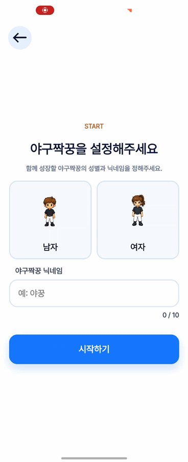
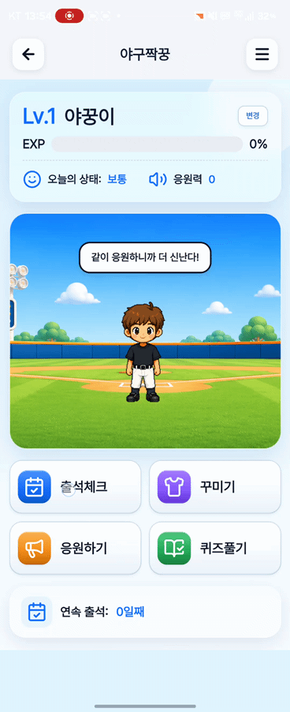
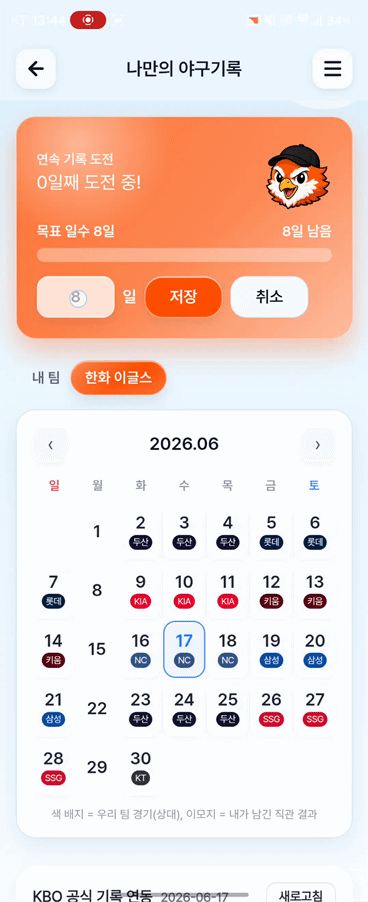
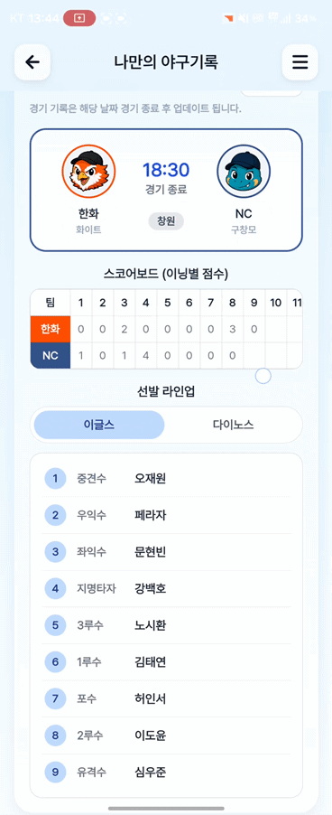
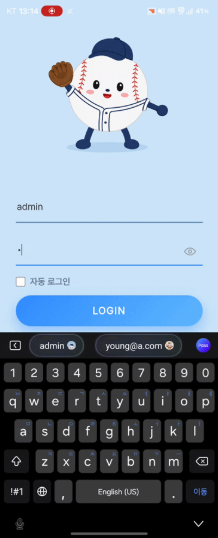
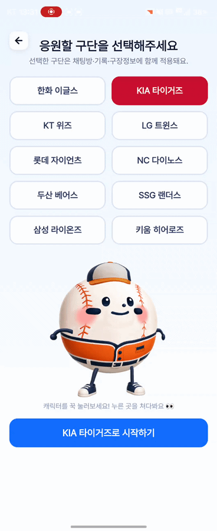
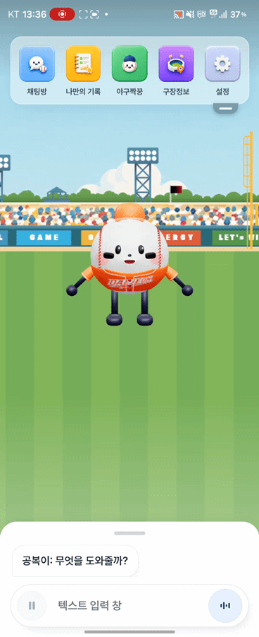
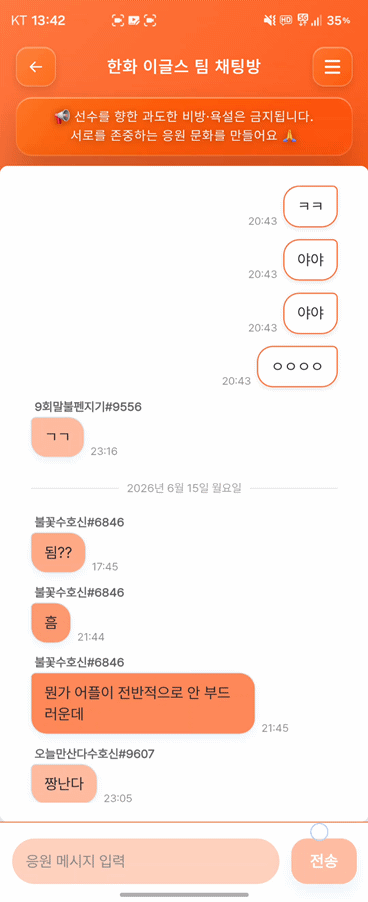

# ⚾ 야구볼래 (YaguBollae)

KBO 야구 입문자를 위한 관람 도우미 앱 — 팀 프로젝트

> 원본 저장소: https://github.com/neunglog-sys/KBO_coach

## 📌 프로젝트 소개
- 야구를 처음 접하는 사람도 쉽게 경기를 즐길 수 있도록 돕는 동반자 앱
- 기간: 2026.06.02 ~ 2026.06.19
- 팀 프로젝트 (프론트엔드 담당)

## 🙋 내가 구현한 기능 (Frontend)
- 🐣 다마고치 캐릭터 시스템 — 성별 선택, 레벨업 보상 로직
- 🏟 라커룸 화면 — 구단별 배경/장비 테마 적용
- 📊 KBO 공식 기록 연동 섹션 — 라인업/스코어보드 API 연동 UI
- 💬 말풍선(스피치 버블) 시스템
- 📅 MyRecordsView — 캘린더 및 KBO 기록 화면
- ✏️ 닉네임 변경 기능

## 🛠 기술 스택
- **Frontend**: React, TypeScript, Vite, Capacitor
- **Backend**: FastAPI, MongoDB Atlas, PostgreSQL (Supabase)
- **AI/기타**: Gemini(Vertex AI), Azure Speech, Firebase

## 🔗 기여 증거
- [내가 작성한 커밋 목록 (20+ commits)](https://github.com/neunglog-sys/KBO_coach/commits?author=pazzosni)
- [내가 올린 PR 목록 (merged)](https://github.com/neunglog-sys/KBO_coach/pulls?q=is%3Apr+author%3Apazzosni)

## 📷 스크린샷
## 📷 스크린샷

### 🙋 내가 구현한 화면

<table>
  <tr>
    <td align="center"></td>
    <td align="center"></td>
    <td align="center"></td>
    <td align="center"></td>
  </tr>
  <tr>
    <td align="center"><b>야구짝꿍 설정</b> 성별 선택 · 닉네임 입력</td>
    <td align="center"><b>다마고치 캐릭터</b> 레벨업 · 말풍선 시스템</td>
    <td align="center"><b>MyRecordsView</b> 경기 일정 캘린더</td>
    <td align="center"><b>KBO 공식 기록 연동</b> 스코어보드 · 선발 라인업</td>
  </tr>
</table>

### 📱 앱 전체 화면 (팀 공동 작업)

<table>
  <tr>
    <td align="center"></td>
    <td align="center"></td>
    <td align="center"></td>
    <td align="center"></td>
  </tr>
  <tr>
    <td align="center"><b>로그인</b></td>
    <td align="center"><b>구단 선택</b></td>
    <td align="center"><b>메인 홈</b></td>
    <td align="center"><b>팀 채팅방</b></td>
  </tr>
</table>
